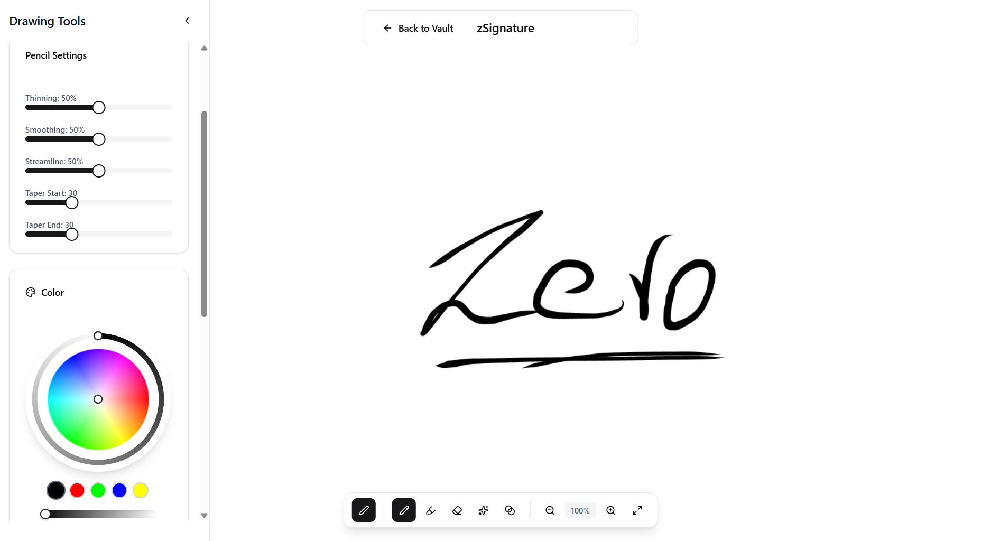
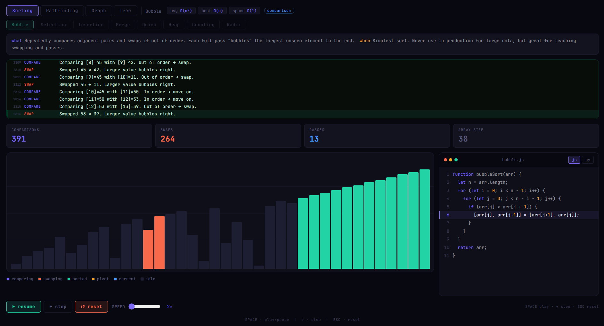

This article never ships — it is a draft that exists to exercise every element the blog renders. The first paragraph is ordinary body text with **bold**, *italic*, ~~strikethrough~~, `inline code`, an [internal link to the blog](/blog/) and an [external link to MDN](https://developer.mozilla.org/en-US/docs/Web/API/Canvas_API).

## Typography and inline elements

Body copy should read comfortably at about eighty characters per line. This paragraph is long on purpose so line length, line height and paragraph rhythm can be judged at every breakpoint. A second sentence keeps going so the paragraph wraps several times, the way real explanations do when they walk through a decision step by step.

A long unbreakable URL must wrap instead of widening the page: https://example.com/a/really/long/path/that/keeps/going/and/going/without/any/natural/break/points/whatsoever/index.html

Long inline code must wrap too: `someVeryLongFunctionNameThatShouldWrapGracefullyOnSmallScreensWithoutBreakingLayout()`.

### Example

The first heading named "Example" — its TOC link must point here.

### Heading with `inline code`

Headings can contain code and still produce a clean anchor.

### Content

A heading whose text matches a layout landmark. Its id must not collide with the page's own ids (skip link, footer sections).

### Deep dives heading

Another heading chosen to collide with a footer section id if layout ids were lowercase.

## Lists

- Unordered item one
- Unordered item two with a nested list:
  - Nested item A
  - Nested item B
- Unordered item three

1. Ordered step one
2. Ordered step two
   1. Nested ordered step
3. Ordered step three

- [x] A completed task
- [ ] An open task

### Example

The second heading named "Example" — it must get a different id from the first one.

## Code

```ts title="src/engine/stroke.ts" {3-4}
export function smooth(points: Point[], factor = 0.5): Point[] {
  if (points.length < 3) return points;
  const result: Point[] = [points[0]];
  for (let i = 1; i < points.length - 1; i++) {
    const prev = points[i - 1];
    const next = points[i + 1];
    result.push({ x: points[i].x * (1 - factor) + ((prev.x + next.x) / 2) * factor, y: points[i].y * (1 - factor) + ((prev.y + next.y) / 2) * factor });
  }
  result.push(points[points.length - 1]);
  return result;
}
```

```bash
npm run build && npx wrangler pages deploy dist --project-name zerro --branch main --commit-dirty=true
```

```diff
- const width = element.offsetWidth;
+ const { width } = element.getBoundingClientRect();
```

## Tables

| Approach | Layout model | Handles overlap | Responsive | Notes |
|---|---|---|---|---|
| Absolute positioning | Fixed x/y coordinates from the editor | Yes | No | Breaks below the editor's canvas width |
| Flex rows | Rows inferred from vertical overlap | Partially | Yes | Needs grouping heuristics for nested elements |
| CSS grid | Explicit tracks from element edges | Yes | Yes | Most faithful, but generates many tracks |

## Images





## Callouts and quotes

> [!NOTE]
> A note adds context the reader may want.

> [!TIP]
> A tip suggests a better way to do something.

> [!IMPORTANT]
> Important information the reader needs to succeed.

> [!WARNING]
> A warning about something that can go wrong.

> [!CAUTION]
> Caution about risky or destructive outcomes.

> A normal blockquote, for quoting someone else's words.

---

## Wrapping up

The horizontal rule above and this final section close the article, so the footer — related project, more from the blog and the deep dives — can be checked below it.
