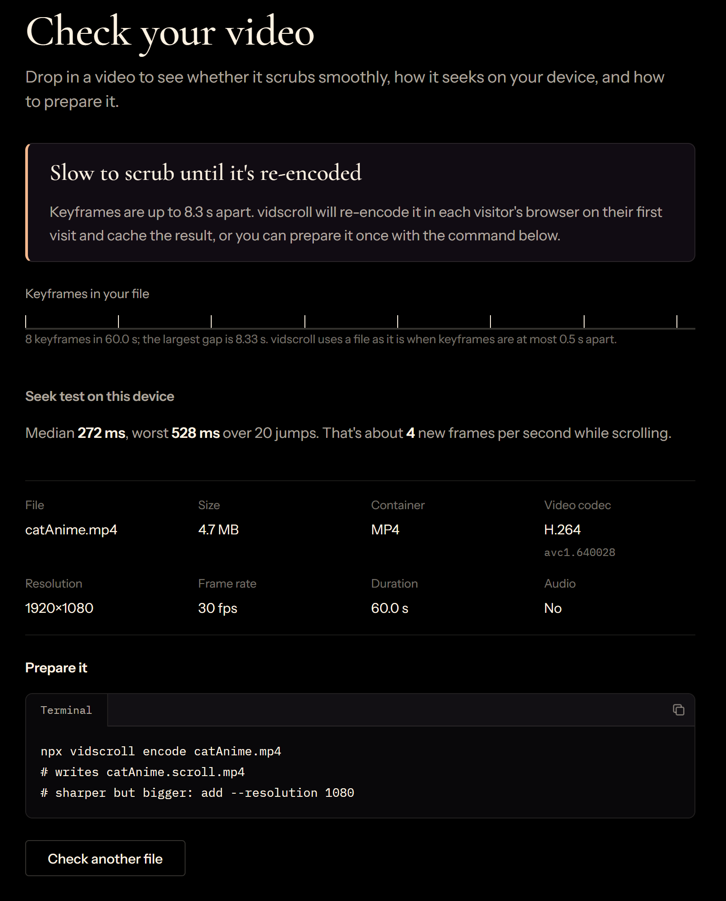

A video that moves with the page is one of the nicer effects on the web. A product turns as you scroll, or a scene plays out at the reader's pace. It looks like a few lines of JavaScript, and with the right file it is. With a video exported straight from an editor, the same few lines stutter, and scrolling backwards is worse. This article explains where that stutter comes from, what the usual fixes cost, and the approach I ended up building into a small library, [vidscroll](https://vidscroll.js.org/), so that any video file scrubs smoothly.


## The obvious approach: set `currentTime` on scroll

My first version was the obvious one. Pin a `<video>`, put a tall spacer behind it, and on each animation frame map the scroll position to a time in the video. Simplified, it comes down to this:

```ts
const onScroll = () =>
  requestAnimationFrame(() => {
    const max = spacer.scrollHeight - innerHeight;
    const progress = Math.min(Math.max(scrollY / max, 0), 1);
    video.currentTime = progress * video.duration;
  });

window.addEventListener("scroll", onScroll, { passive: true });
```

With a video prepared for scrubbing, this keeps up with the scroll. With a typical export, the same code stutters.

Nothing in the handler changes between those two cases. The only difference is the file, so that's where the problem is. Rewriting the scroll logic won't fix it.

## Why exported videos stutter when you scrub them

A video file doesn't store every frame as a picture. Every so often it stores a complete one, a keyframe, and the frames in between only store what changed. To show any frame, the browser starts at the keyframe before it and decodes forward.

Normal playback never notices, because it only moves forward. Scrubbing jumps to a new point many times a second, in both directions, and every jump pays for the walk from the previous keyframe.

Most exported videos have keyframes a few seconds apart, because that keeps files small. A 60-second 1080p export I tested had 8 keyframes in total, one every 8.3 seconds. On the demo clip I measured, the median seek took 287 ms. That's under four new frames per second, however fast the rest of the page runs.

For scrubbing, keyframe spacing matters more than resolution, bitrate or codec. Lowering the resolution of a file with sparse keyframes rarely fixes the stutter.

You can check a file with `ffprobe`, which lists the time of every keyframe:

```bash
ffprobe -v error -select_streams v:0 -skip_frame nokey -show_entries frame=pts_time -of csv=p=0 hero.mp4
```

Gaps of up to about half a second scrub well. Anything much longer and every seek gets expensive.

 and prepared for scrubbing (bottom).")

## Two common fixes, and what they cost

### Prepare every file

Re-encode the video with keyframes close together, for example one every 10 frames. Scrubbing becomes smooth, because any frame is at most about 10 frames from a keyframe. With ffmpeg, for a landscape video, the flags that matter are these:

```bash
ffmpeg -i hero.mp4 -an -vf scale=-2:720 -c:v libx264 -preset slow -pix_fmt yuv420p \
  -g 10 -keyint_min 10 -sc_threshold 0 -crf 22 -movflags +faststart hero.scroll.mp4
```

`-g 10 -keyint_min 10` puts a keyframe every 10 frames, and `-sc_threshold 0` stops the encoder adding extra ones at scene cuts.

The cost is that someone has to do it for every video, every time the video changes, and the files get bigger:

| The same 60 s clip | Size | Keyframes |
| --- | --- | --- |
| Original export, 1080p | 4.7 MB | 8, one every 8.3 s |
| Prepared, 720p | 11.9 MB | 180, one every 0.33 s |
| Prepared, 1080p | 22.4 MB | 180, one every 0.33 s |

### Decode every frame up front

Decode all frames into images ahead of time and draw them to a canvas. Scrubbing is then instant, whatever the file.

The cost is memory. A decoded 1080p frame is about 8 MB, so 10 seconds at 30 fps comes to about 2.5 GB. That works for a few seconds of small video, and not for a minute of HD on a phone.

## A third route: fix the file only when it needs fixing

The third route is to take whatever file you're given, keep it compressed, and fix it only when its keyframes are too far apart. That takes four pieces, and vidscroll is built from them.

### Read the keyframe layout without decoding

An MP4 already says where its keyframes are. The sample table in the file's index lists which frames are keyframes (the `stss` box) and how long each frame lasts (`stts`), and fragmented MP4s carry the same information in their `moof`/`trun` boxes. Reading those boxes takes a small parser and no decoding at all; in vidscroll it's `src/core/probe.ts`. Other containers, such as WebM, need a demuxer instead.

From that list, the largest gap between keyframes tells you whether the file is fine as it is. vidscroll uses 0.5 seconds as the limit.

### Re-encode in the browser with WebCodecs

If the gaps are too long, the [WebCodecs API](https://developer.mozilla.org/en-US/docs/Web/API/WebCodecs_API) lets the page re-encode the video with the browser's own encoder. vidscroll uses [Mediabunny](https://mediabunny.dev/) on top of it, loaded only when a re-encode is needed, so pages with prepared files never download it.

The copy has a keyframe every quarter of a second, a short side of at most 720 px, at most 30 frames per second, and no audio. In my tests, a 60-second 1080p clip took about 8 to 10 seconds to re-encode on a desktop computer and about 20 seconds on a phone. Shorter clips are proportionally faster.

### Cache the result

Re-encoding on every visit would waste those seconds each time. The copy goes into the browser's [Cache Storage](https://developer.mozilla.org/en-US/docs/Web/API/CacheStorage), so later visits load it straight away, with no download and no re-encode.

The cache key has to change whenever the result would. vidscroll ties each entry to the video's URL, the re-encode settings, and the file's `ETag`, `Last-Modified` or `Content-Length`, so replacing the file on the server starts over.

### Let people scroll while it works

Waiting behind a spinner would leave the page blank for the whole re-encode. Instead, the downloaded original goes on screen straight away.

Scrolling forward plays it, with `playbackRate` following the scroll speed. Playing forward never goes back to a keyframe, so it stays smooth even on a badly encoded file. Scrolling backwards still has to seek, so it's choppy for those few seconds.

When the copy is ready, a second `<video>` stacked underneath seeks to the current time and then takes over. It lands on exactly the frame on screen, so the switch isn't visible.

## Using it on a page

In React, a `<ScrollVideo>` is a block in your page, and each `<Section>` is active over part of the scroll:

```tsx
import { ScrollVideo, Section } from "vidscroll";

export default function Hero() {
  return (
    <ScrollVideo src="/videos/hero.mp4" length="400vh" smoothScroll>
      <Section start={0} end={0.33}>
        <h1>Intro</h1>
      </Section>
      <Section start={0.33} end={0.66}>
        <h1>Middle</h1>
      </Section>
      <Section start={0.66} end={1}>
        <h1>Outro</h1>
      </Section>
    </ScrollVideo>
  );
}
```

`src` is any URL to a video file: your public folder, a CDN, or a bundler import. Without React, the experimental [`<vid-scroll>` element](https://vidscroll.js.org/docs/without-react/element/) does the same on any page.

For production, the package's CLI runs that same kind of ffmpeg command for you, so visitors never wait for a re-encode:

```bash
npx vidscroll encode public/videos/hero.mp4
```

I built it for landing pages, homepages and storytelling sites, the kind of scrollytelling where text is tied to scenes and the reader sets the pace.

## Where it doesn't fit yet

- **Long videos, especially at 1080p.** Anything over about two minutes or 100 MB gets slow to download and to re-encode, and vidscroll warns in the console. Trim the video, or prepare it with the CLI.
- **The browser's copy is bigger than the CLI's.** For the 60-second clip, the in-browser re-encode made 18.6 MB where the CLI makes 11.9 MB at the same resolution. It only lives in the visitor's browser, but it's one more reason to prepare videos for production.
- **The first visit to an unprepared video.** Scrolling backwards is choppy until the smooth copy arrives.
- **Videos with sound.** Scroll-driven video is always muted, and the re-encode drops the audio.
- **Caching needs the right headers.** Without `ETag`, `Last-Modified` or `Content-Length`, there's no way to tell whether the file changed, so the re-encode runs on every visit. Caching also needs HTTPS or `localhost`.

## Before you build your next scroll video

Whatever you build it with, three things decide whether it feels smooth:

1. **Check the keyframes before the code.** If scrubbing stutters, look at the file first. Gaps over half a second will hurt, however good the scroll handler is.
2. **Prepare the files you control.** One ffmpeg command with closely spaced keyframes beats fixing it at runtime: a smaller download and smooth scrubbing from the first visit. Use 720p unless the video fills a large screen.
3. **For the files you don't, fix them once and remember it.** Read the container instead of decoding it, re-encode only when the gaps are too long, cache the result, and keep the page scrollable while that runs.

That's the whole idea behind vidscroll, and you can try it without installing anything. Drop one of your own videos into the [video checker](https://vidscroll.js.org/docs/videos/checker/): it shows every keyframe, times seeks on your device and gives you the command to fix the file. The video is read in the page and never uploaded.



If the result looks like the one above, you've found your stutter, and fixing it is one command. To see the rest, there are [demos](https://vidscroll.js.org/#demos), a [playground](https://vidscroll.js.org/playground/) for the options, and a longer explanation of [how it works](https://vidscroll.js.org/docs/start/how-it-works/). The code is on [GitHub](https://github.com/nikhilswain/vidscroll), and the package is on [npm](https://www.npmjs.com/package/vidscroll):

```bash
npm i vidscroll
```

Scroll-driven video is one of the few effects on the web that hands the pace of a story to the reader. When it stutters, the whole effect falls apart, and it's easy to blame the scroll code, the framework or the device. Often the cause is sitting in the file: keyframes a few seconds apart. Once you know that, it stops being a mystery and becomes a fixable problem, whether you fix it with one ffmpeg command, build the runtime fix yourself, or let a library do it.

If you try it on a video that doesn't behave, [open an issue](https://github.com/nikhilswain/vidscroll/issues) with the checker's report. Odd files make the best test cases.
